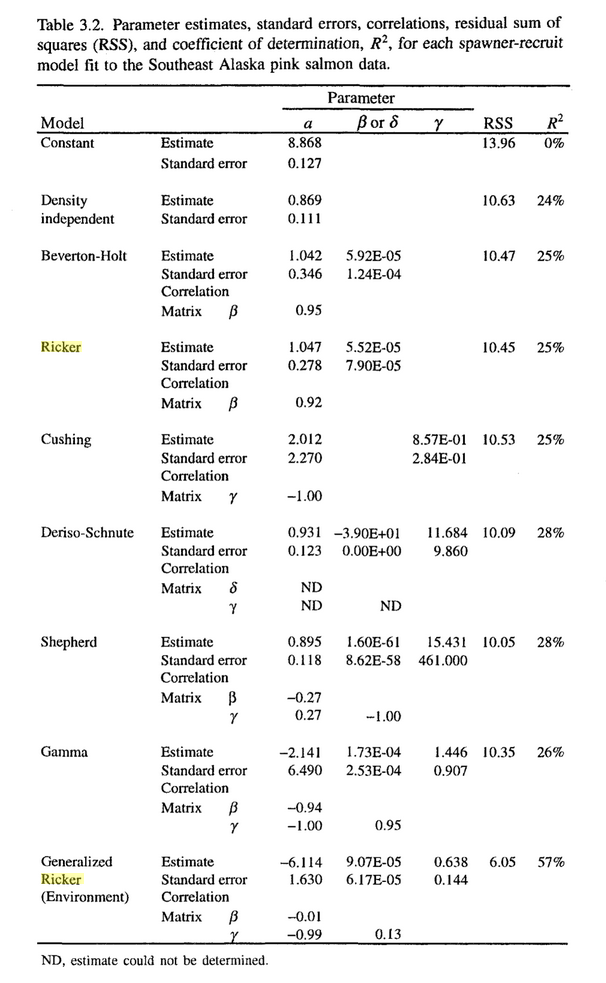

<style>
.refs {
   font-size: 14px;
}
h2 { 
 color: #3399ff;		
}
h3 { 
 color: #3399ff;		
}
.title-slide {
   background-color: #55bbff;
}

.pre {
  height: 30pc;
  overflow-y: scroll;
}

<!-- https://stackoverflow.com/questions/50378349/force-column-break-in-rmarkdown-ioslides-columns-2-layout -->
.forceBreak { -webkit-column-break-after: always; break-after: column; }
</style>

```{r setup, include = FALSE}
knitr::opts_chunk$set(echo = FALSE, dpi = 200, optipng = knitr::hook_optipng)
options(bitmapType = "cairo")
```

```{r pkgs, message = FALSE}
library(knitr)
library(ggplot2); theme_set(theme_bw(base_size=16))
library(scam)
library(mgcv)
```

# Shape-constrained models

## @levinsStrategy1966

1. realism and precision [engineering: "tactical" models]
2. precision and generality [physics/"spherical cow": Lotka-Volterra style]
3. realism and generality [math]

## parametric models

:::: {style="display: grid; grid-template-columns: 1fr 1fr; grid-column-gap: 50px;"}

::: {}

- precise, more realistic, less general
- often choose from large family of options
- very particular assumptions
   - e.g. power-logistic vs. $t$-distribution
- interpretable/testable parameters

:::

::: {}

@quinnQuantitative1999

```{r param-models, out.width=350}

```

:::

::::

## realism via nonparametric models

* curves

## semiparametric models

@ellnerNoise1998b, @woodPartially2001

## shape-constrained models


## bases

```{r bases, echo = FALSE, out.width = "100%"}
set.seed(101)
dd <- data.frame(x=seq(-5, 5, length = 101))
dd <- within(dd, {
             mu <- 1 + x - x^3/4
             y <- rnorm(length(mu), mu, sd = 1)
             })
sm0 <- smoothCon(s(x, bs = "tp"), data = dd, absorb.cons = TRUE)[[1]]
sm1 <- smoothCon(s(x, bs = "mpd"), data = dd, absorb.cons = TRUE)[[1]]
sm2 <- smoothCon(s(x, bs = "ps"), data = dd, absorb.cons = TRUE)[[1]]
colvec <- palette.colors(n=8)
pfun <- function(x, main) {
    matplot(x, type = "l", main = main, col = colvec, ylab = "", xlab = "",
            lwd = 2)
}
par(mfrow=c(1,2), las = 1, bty = "l")
pfun(sm2$X, "P-spline")
pfun(sm1$X, "Monotonic p-spline")
```

## reed frog example

## waterbug example

## goal/loose ends

* make shape-constrained bases more generally available  
(e.g. as components of more complex/semimechanistic models)
    * RTMB
	* glmmTMB?
* expand set of possible constraints (e.g. unimodal functions)

<!-- https://bookdown.org/yihui/rmarkdown-cookbook/multi-column.html -->

<!--
:::: {style="display: grid; grid-template-columns: 1fr 1fr; grid-column-gap: 50px;"}

::: {}

:::

::: {}

```{r, out.width=300, out.height=300}
## knitr::include_graphics("pix/dependency_2x.png")
```

:::

::::
-->


## references {.refs .columns-2 .pre}

